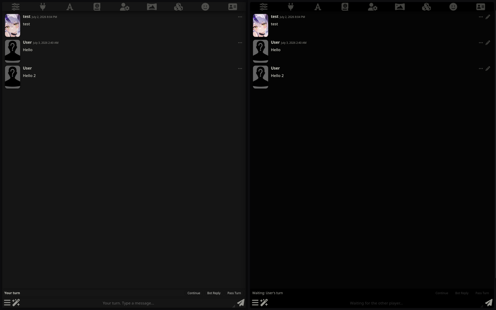
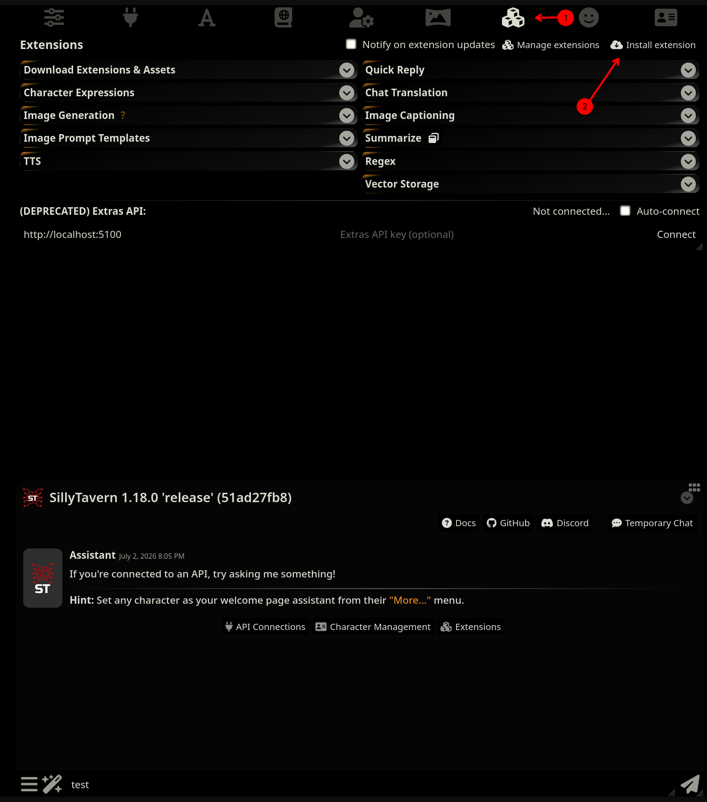
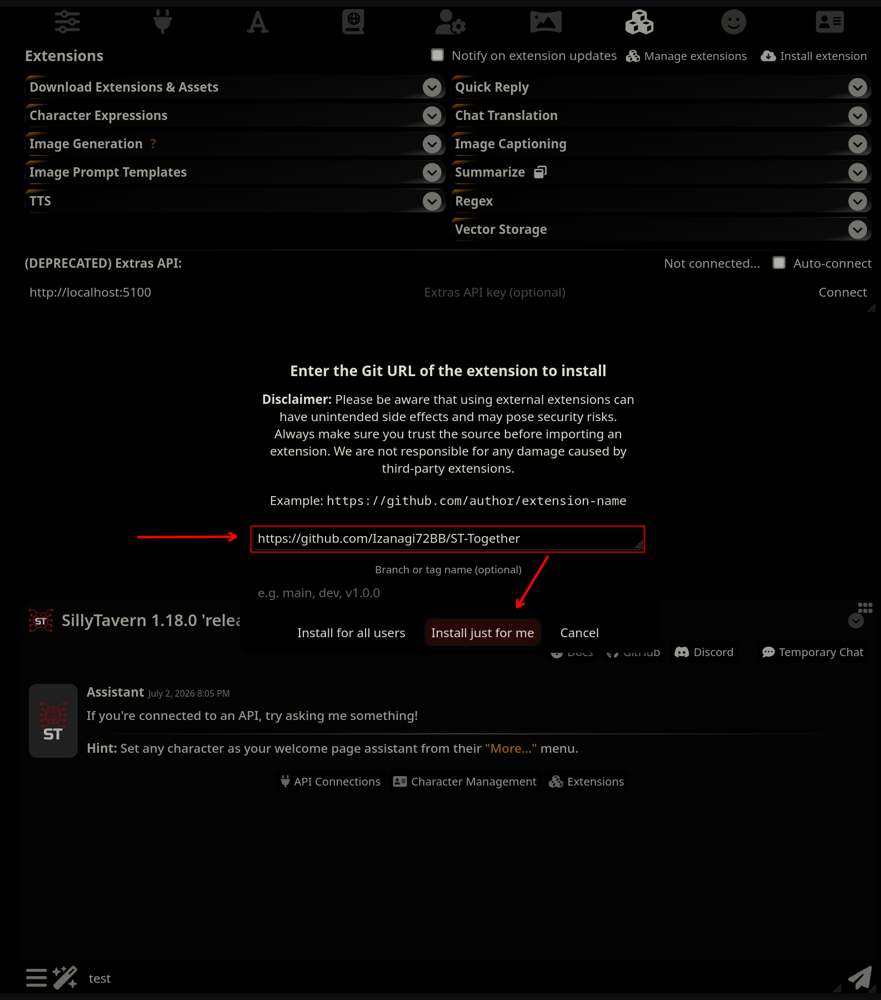
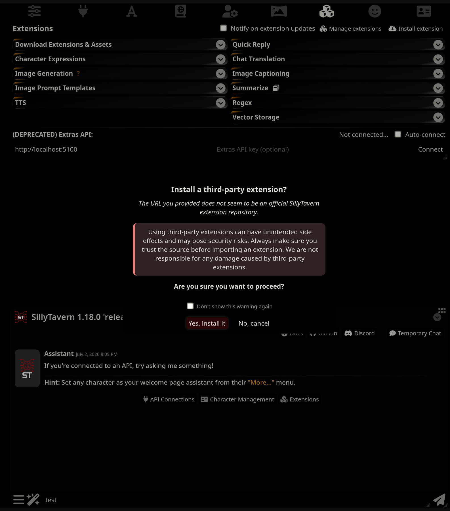
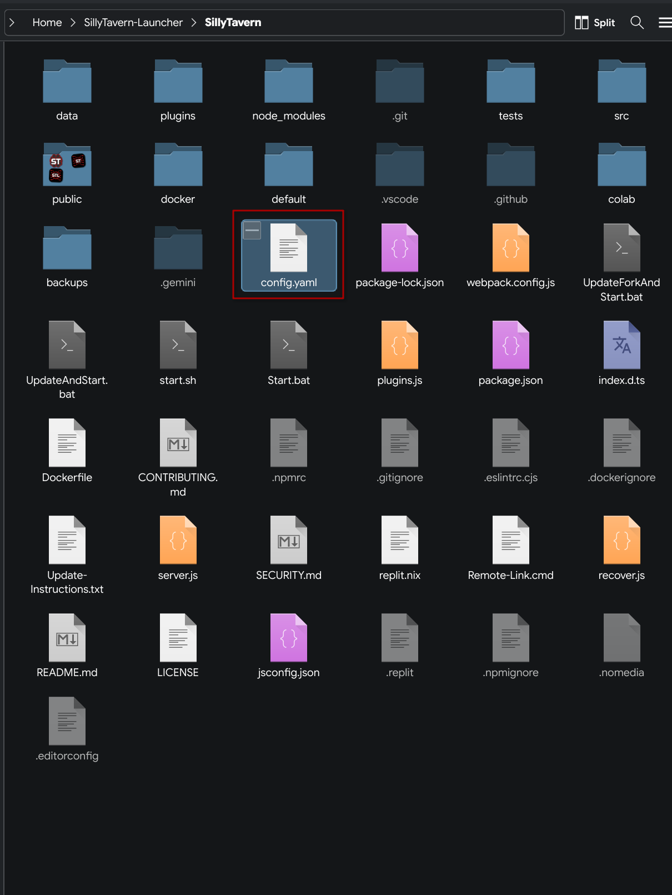
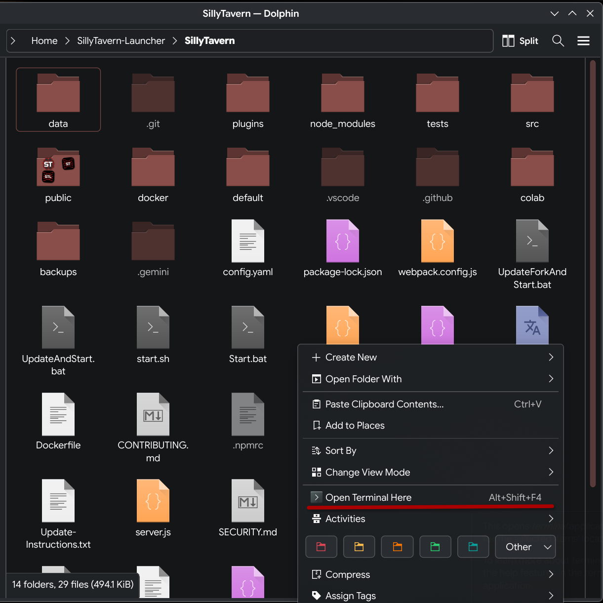
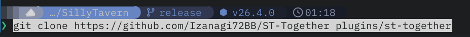
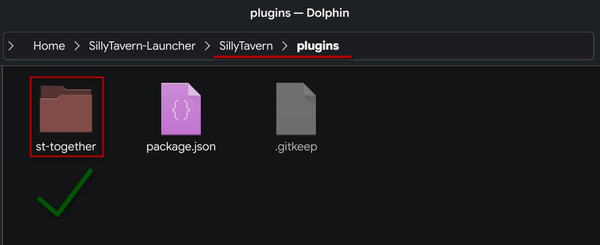
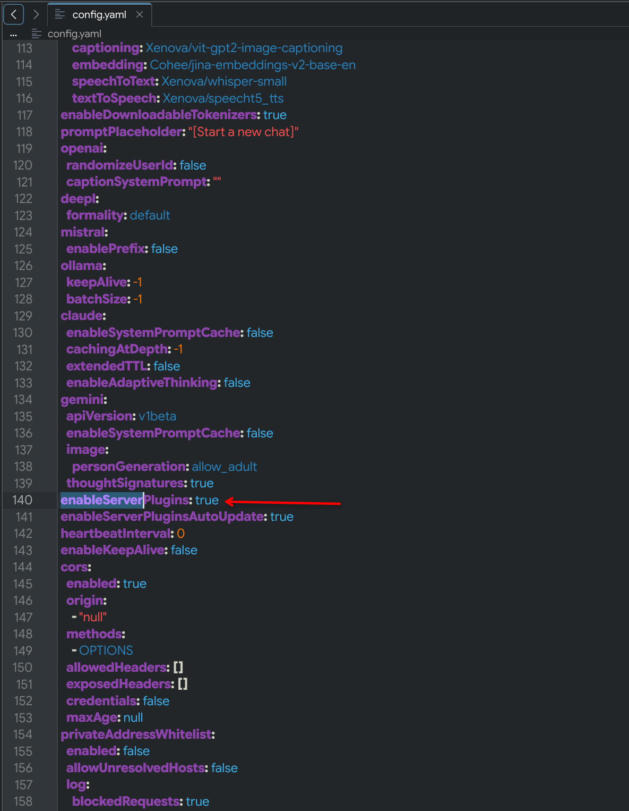
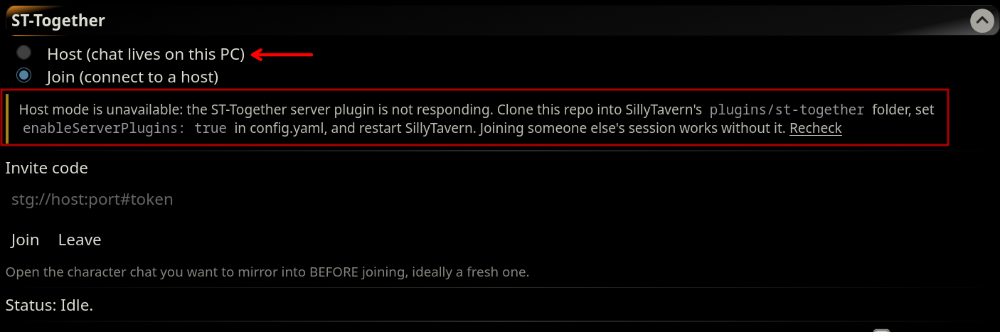

# ST-Together

Turn-based multiplayer for SillyTavern. You and a friend, each on your own
SillyTavern instance anywhere in the world, share one chat with one AI
character. The chat and the LLM API connection live entirely on the host's
machine; the guest needs no API key and no configuration beyond this
extension.



## How it works

- The **host** runs a small server plugin that referees the session:
  token-authenticated WebSocket, turn order, message relay.
- Both players install the same UI extension and pick a role: Host or Join.
- The WebSocket rides on SillyTavern's own address and port, so it works
  wherever your SillyTavern already works: a public domain, a reverse proxy,
  Cloudflare, or a LAN IP. If your friend can open your SillyTavern in a
  browser, the invite works with no extra setup.
- If your SillyTavern is only reachable on your own machine, tick **Expose
  via Cloudflare tunnel** and the plugin spins up a throwaway
  trycloudflare.com URL for the invite. No domain, no port forwarding, no
  exposed home IP; the URL dies when the session stops.
- Turns are fluid: the turn holder can write (the bot replies), extend the
  bot's last message (Continue), have the bot speak again (Bot Reply), or
  hand over (Pass Turn). Optionally the turn can auto-pass after each reply.
- Drafts are private. Only a boolean "is typing" signal leaves your machine,
  shown to the other player as a "X is writing" indicator with bouncing dots.
  The bot's reply streams live to both players.

## Install: guest

If you are only joining a friend's session, this is all you need.

1. In SillyTavern, open the **Extensions** panel (the stacked-blocks icon in
   the top bar) and click **Install extension**.
2. Paste `https://github.com/Izanagi72BB/ST-Together` and confirm.

That's it. Skip to [Play](#play).

## Install: host

The host needs two parts: the UI extension (installed from inside
SillyTavern, exactly like the guest above) and the server plugin (installed
with one command in a terminal, one time only).

### Part 1: the UI extension

Open the **Extensions** panel and click **Install extension**.



Paste the repository URL and choose **Install just for me**.

```
https://github.com/Izanagi72BB/ST-Together
```



SillyTavern warns that this is a third-party extension. Click
**Yes, install it**.



### Part 2: the server plugin

**Step 1 — Find your SillyTavern folder.** It is the folder that contains
`config.yaml`, plus `Start.bat` (Windows) or `start.sh` (Linux/Mac). If you
use the SillyTavern Launcher, it is the `SillyTavern` folder inside the
launcher's folder.



**Step 2 — Open a terminal _inside that folder_.** This matters: the command
in step 3 creates the plugin folder relative to wherever your terminal is
standing, so running it from the wrong place puts the plugin in the wrong
place.

- **Windows:** open the SillyTavern folder in File Explorer, click the
  address bar at the top, type `cmd`, and press Enter. A terminal opens
  already inside the folder.
- **Linux (KDE/Dolphin shown):** right-click empty space in the folder and
  choose **Open Terminal Here**. Most Linux file managers have the same
  option; on Mac, right-click the folder and choose
  **New Terminal at Folder**.



**Step 3 — Clone the plugin.** Run this command (identical on every OS):

```
git clone https://github.com/Izanagi72BB/ST-Together plugins/st-together
```



_Windows note:_ if you get "git is not recognized", install
[Git for Windows](https://git-scm.com/download/win) first, then reopen the
terminal.

**Step 4 — Confirm it landed in the right place.** You should now have a
`st-together` folder inside `plugins`. Check the breadcrumb reads
`SillyTavern > plugins`. If the folder ended up somewhere else, delete it and
redo step 2 with the terminal in the correct folder.



**Step 5 — Enable server plugins.** Open `config.yaml` (in the SillyTavern
folder) in any text editor, find `enableServerPlugins: false`, and change
`false` to `true`.



**Step 6 — Restart SillyTavern fully.** Close the server process and start it
again (a browser refresh is not enough; the plugin only loads at server
startup).

### Updating later

Automatic or one click: SillyTavern re-pulls the server plugin on every
server start, and the UI extension updates from the **Update** button under
Manage extensions. You never repeat the steps above.

The tunnel uses `cloudflared`. If it is installed system-wide the plugin uses
that; otherwise the plugin downloads the binary into its own folder on first
use.

## Play

1. **Host:** open the character chat you want to play in, then open the
   ST-Together drawer in the Extensions panel, pick **Host**, and click
   **Start Session**. If your friend can already reach your SillyTavern in a
   browser (public domain or LAN), leave the tunnel unticked. Only tick
   **Expose via Cloudflare tunnel** if your SillyTavern is purely local;
   starting with the tunnel takes 30-60 seconds while its URL goes live.
2. Send the invite code (`https://your-server#token`) to your friend.
3. **Guest:** open any character and a fresh chat to mirror into, pick
   **Join** in the ST-Together drawer, paste the invite, and click **Join**.
   The host's chat syncs over automatically.
4. Play. The action bar above the input shows whose turn it is and holds the
   **Continue**, **Bot Reply**, and **Pass Turn** buttons. In the screenshot
   at the top of this page, the host (left) has the turn while the guest
   (right) is locked with "Waiting: User's turn".

## Troubleshooting

**"Host" is greyed out.** The UI extension cannot reach the server plugin, so
only Join is available. This means the server plugin from Part 2 is not
installed or not loaded: clone it into `plugins/st-together`, set
`enableServerPlugins: true` in `config.yaml`, and restart SillyTavern. Then
click **Recheck**.



## Notes and limitations

- Host edits, deletes, and swipes sync to guests. Guest-side editing and
  swiping are disabled by design.
- Switching chats mid-session is handled with a prompt. The host chooses
  between sharing the newly opened chat, sharing a fresh chat with that
  character, or pausing the session until they return to the shared chat
  (guests see a "host is in another chat" lock meanwhile). Guests get a
  similar prompt to move their local mirror.
- Two instances on one machine for testing: open them under different
  hostnames (for example `127.0.0.1:8000` and `localhost:8001`), otherwise
  the instances fight over cookies and requests fail with CSRF errors.
- One host and up to three guests per session; designed and tested for two
  players.
